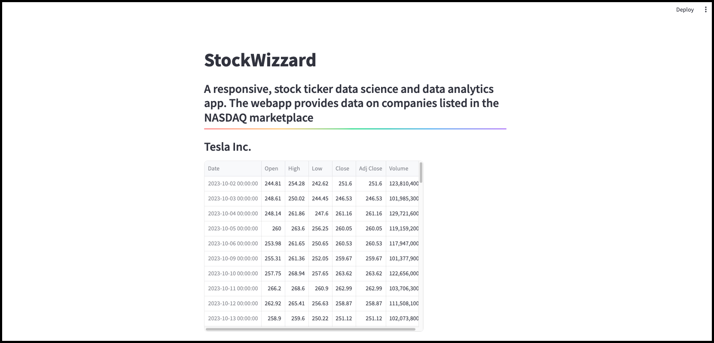
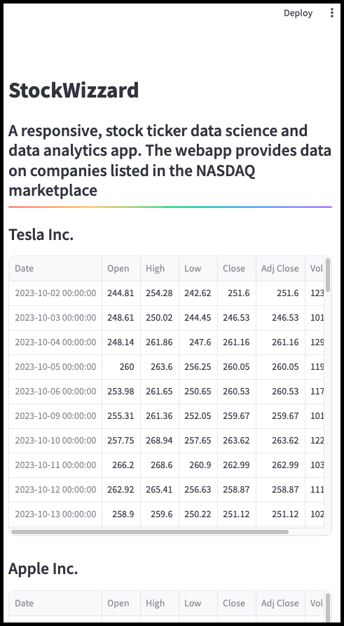

# StockWizzard

Stock ticker data science app created using Python. Provides data on multiple companies inside the stock market for a one year period.

## Current app screenshots:

### Screenshot for the data analytics app

### Mobile screenshot for the data analytics app

### Future app updates:

- Have all current preselected companies show up in one multi select form
- Have a working search request feature implemented inside the website
- Improve UI design for app. Add more interactivity
- Add logo and branding design for the app

### How to contribute to this repository

Please read the [Contributing doc](./docs/contributing_template.md) file for details
